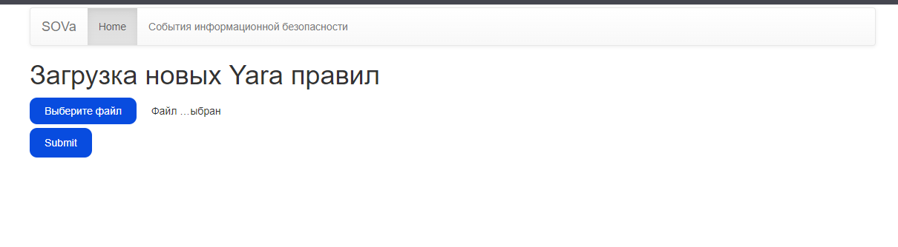
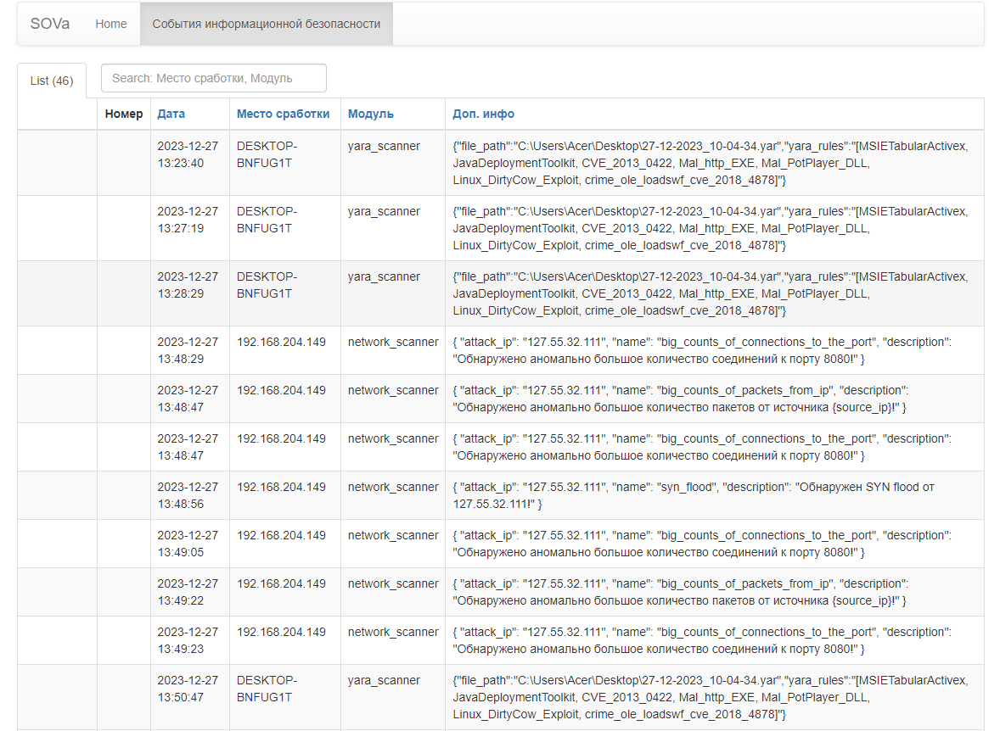

# Система обнаружений вторжений SOVa

---

## Quick start
Склонируйте репозиторий в рабочую директорию и перейдите в нее
```bash
git clone https://github.com/10q/SOVa
cd SOVa
```
### Консоль управления
#### Запуск
Консоль управления находится в директории **SOVa_console**
Перейдите в нее
```bash
cd SOVa_console
```
Для сборки образов пропишите в терминале
```bash
sudo docker-compose build
```  
Запустите
```bash
sudo docker-compose up
```
или для запуска в фоне
```bash
sudo docker-compose up -d
```
Откройте браузер и перейдите по ссылке
http://localhost:5000/ или http://*<your_console_ip>*:5000/ (если вход с удаленного хоста)

Вас встретит окно логина


Логин/пароль администратора **admin**/**admin**

#### Использование
Существует разделение ролей:
- Администратор
    - Просмотр СИБов
    - Загрузка новых yara правил
    - Просмотр и регистрация обычных пользователей
- Обычный пользователь
    - Просмотр СИБов
    - Загрузка новых yara правил

После логина происходит переход на главную страницу, где можно обновить yara правила:


Просмотр СИБов происходит на вкладке **События информационной безопасности**


#### Создание пользователей
Для того чтобы создать нового обычного пользователя, необходимо залогинится под администратором и перейти по ссылке http://*<your_console_ip>*:5000/register

Просмотреть пользователей можно на вкладке **Пользователи** на домашней странице 

------

### Сканер конечных точек
#### network_scanner,2023

[SOVa Team]
scaner.py it is a network scanner wich can detect varios network attacks
##### Зависимости
--python3.9
--scapy
--logger
--requests
```bash
pip install scapy logger requests
```
##### Использование
Первоначально необходимо установить сетевой сканер как службу
Запускаем скрипт run_scaner.sh, который принимает 2 аргумента: интерфейс, на котором будет работать сетевой сканер и ip-адрес консоли, куда будут отправляться СИБы.
От пользователя root даем скрипту права на выполнение:
```bash
chmod +x run_scaner.sh
```
Запускаем скрипт:
```bash
./run.sh <listen_interface_name> <your_console_ip>
```
После чего в терминале появится статус службы

Для проверки работоспособности сканера достаточно запустить скрипт test/tcp.py, который будет отправлять большое количество TCP пакетов с установленным флагом SYN.

---

### Сетевой сканер
#### yara_scanner.py
##### Tsenturion,2023

[SOVa Team]
yara_scanner.py it is a nice tool to make your PC life more safety.

Скрипт запускается в фоновом режиме на всех контролируемых узлах и конечных точках сети

Проверка обновлний и сканирование происходит раз в час
##### Зависимости
--python3.9
--yara-python(install with pip)

Install the dependencies  and start the scanning.
```bash
pip install yara-python
```
##### Опции
 - **-h**\\**-help** : справка об опциях;
 - **-i**\\**-ip**: ip-адресс сервера(обязательный аргумент);
 - **-p**\\**-port**: номер порта(обязательный аргумент).
##### Запуск
```bash
python3 yara_scanner.py -h
python3 yara_scanner.py -i *<your_console_ip>* -p 5000
```
---